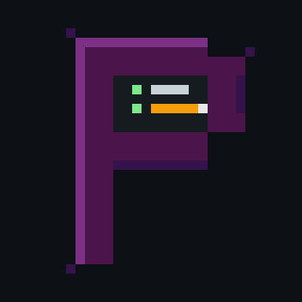

<div align="center">



# @postcli/slack

**Your entire Slack, from the terminal.**

Browse channels. Post messages. React. Search. Power AI agents.

[](https://www.npmjs.com/package/@postcli/slack)
[](https://github.com/postcli/slack/actions)
[](LICENSE)
[](package.json)
[](https://modelcontextprotocol.io)
[](https://github.com/postcli/slack/issues)

<br/>

[Getting Started](#getting-started) &#8226;
[CLI](#cli) &#8226;
[MCP Server](#mcp-server) &#8226;
[API](#programmatic-api) &#8226;
[Contributing](#contributing)

</div>

<br/>

## Why @postcli/slack?

Slack's official API requires bot tokens, OAuth apps, and admin approval. PostCLI Slack works like the web client: it grabs your session from the Slack desktop app and talks directly to the same endpoints your browser uses. No bots, no apps, no admin.

<table>
<tr>
<td width="33%" align="center">

**CLI**

Full command suite for channels, messages, threads, search, reactions, and status. Pipe-friendly `--json` output.

</td>
<td width="33%" align="center">

**MCP Server**

16 tools for Claude, GPT, and any MCP-compatible AI agent. Read, write, react, and search through natural language.

</td>
<td width="33%" align="center">

**Multi-workspace**

Auto-detects all workspaces from your Slack desktop app. Switch between them seamlessly.

</td>
</tr>
</table>

## Getting Started

### Prerequisites

- **Node.js 18+** (LTS recommended)
- **Slack desktop app** logged into your workspace(s)
- macOS or Linux

### Install

```bash
npm install -g @postcli/slack
```

### Authenticate

PostCLI grabs session tokens directly from the Slack desktop app (Flatpak, native, or snap):

```bash
postcli-slack auth login
```

It auto-detects your workspaces:

```
Found 4 token(s). Detecting workspaces...
  Apache Airflow Community (@andre451)
  Building AI Together by Union.ai (@andre259)
  Provero (@andre)
  Apache Hamilton Open Source (@andre)

Connected as andre451 in workspace Apache Airflow Community
Credentials saved to .env
```

Alternative: manual token paste from browser DevTools with `postcli-slack auth setup`.

### Verify

```bash
postcli-slack auth test
# Connected as andre451 in workspace Apache Airflow Community
```

## CLI

### Read

```bash
postcli-slack channels list                           # list channels
postcli-slack channels info general                   # channel details
postcli-slack messages history general --limit 20     # message history
postcli-slack messages thread general 1234567890.123  # read a thread
postcli-slack users list                              # list users
postcli-slack users info kumare3                      # user details
postcli-slack search messages "from:kumare3"          # search messages
```

### Write

```bash
postcli-slack post send general "Hello from the terminal"     # post a message
postcli-slack post reply general 1234.5678 "Good point"       # reply in thread
postcli-slack post edit general 1234.5678 "Updated text"      # edit message
postcli-slack post delete general 1234.5678                   # delete message
```

### React

```bash
postcli-slack post react general 1234.5678 thumbsup    # add reaction
postcli-slack post unreact general 1234.5678 thumbsup   # remove reaction
postcli-slack post pin general 1234.5678                # pin message
postcli-slack post star general 1234.5678               # star message
```

### Status

```bash
postcli-slack status set "In a meeting" -e ":calendar:"    # set status
postcli-slack status set "BRB" -d 30                       # auto-clear in 30min
postcli-slack status clear                                 # clear status
postcli-slack status away                                  # set away
postcli-slack status active                                # set active
```

### JSON output

Every command supports `--json` for piping and scripting:

```bash
postcli-slack channels list --json | jq '.[].name'
postcli-slack search messages "deploy" --json | jq '.messages[].text'
```

## MCP Server

Connect your Slack to Claude, GPT, or any AI agent via the [Model Context Protocol](https://modelcontextprotocol.io).

### Start the server

```bash
postcli-slack --mcp
```

### Claude Code

Add to `.claude/settings.json`:

```json
{
  "mcpServers": {
    "slack": {
      "command": "postcli-slack",
      "args": ["--mcp"]
    }
  }
}
```

### Claude Desktop

Add to `claude_desktop_config.json`:

```json
{
  "mcpServers": {
    "slack": {
      "command": "postcli-slack",
      "args": ["--mcp"]
    }
  }
}
```

### Available tools (16)

| Tool | Description |
|------|-------------|
| `test_connection` | Test authentication |
| `list_channels` | List workspace channels |
| `get_messages` | Message history from a channel |
| `get_thread` | All replies in a thread |
| `list_users` | List workspace users |
| `get_user` | User details by ID or username |
| `search_messages` | Search across channels |
| `post_message` | Post a message |
| `reply_to_thread` | Reply in a thread |
| `edit_message` | Edit a message |
| `delete_message` | Delete a message |
| `add_reaction` | React with emoji |
| `remove_reaction` | Remove a reaction |
| `set_status` | Set your status |
| `pin_message` | Pin a message |
| `mark_read` | Mark channel as read |

## Programmatic API

Use the client in your own Node.js projects:

```typescript
import { SlackClient } from '@postcli/slack/client';

const client = new SlackClient({
  token: process.env.SLACK_TOKEN,
  cookie: process.env.SLACK_COOKIE,
  workspace: 'slack',
});

// Read
const channels = await client.listChannels();
const messages = await client.getMessages('C01234ABCD', { limit: 10 });
const thread = await client.getThread('C01234ABCD', '1234567890.123456');
const results = await client.searchMessages('from:kumare3');

// Write
await client.postMessage('C01234ABCD', 'Hello from API');
await client.replyToThread('C01234ABCD', '1234.5678', 'Great point');
await client.addReaction('C01234ABCD', '1234.5678', 'thumbsup');
await client.setStatus('Coding', ':computer:');
```

## Project Structure

```
src/
  cli/
    commands/         # auth, channels, messages, users, search, post, status
    chrome-cookies.ts # Slack desktop cookie + token extraction
  lib/
    slack.ts          # SlackClient (core API wrapper)
    http.ts           # HTTP client with throttling + cookie auth
    models.ts         # Domain models (Channel, Message, User, Thread)
  mcp/
    index.ts          # MCP stdio server
    tools.ts          # 16 tool definitions + handlers
  client.ts           # Client initialization & config
  plugin.ts           # Plugin registration for PostCLI ecosystem
  types.ts            # Slack API response types
```

## How Authentication Works

PostCLI Slack extracts credentials directly from the Slack desktop app:

1. **Cookie `d`**: Read from Slack's SQLite cookie database (Flatpak, native, or snap paths)
2. **Token `xoxc-`**: Extracted from Slack's LevelDB LocalStorage
3. **Decryption**: Uses the same key derivation as Chrome/Electron (PBKDF2 with keyring password)

Credentials are stored at `~/.config/postcli/.env` with `0600` permissions (owner-only read/write). No data leaves your machine.

## Contributing

```bash
git clone https://github.com/postcli/slack.git
cd slack
npm install
npm run build
npm test
```

### Development

```bash
npm run cli -- channels list           # run CLI in dev mode
npm run dev:mcp                        # MCP with inspector
npm test                               # run tests
```

### Guidelines

1. Open an issue first to discuss the change
2. Fork the repo and create a branch from `main`
3. Write tests for new functionality
4. Run `npm test` and `npm run build` before submitting
5. Keep PRs focused on a single change

## Disclaimer

This is an unofficial tool, not affiliated with or endorsed by Slack. It interacts with undocumented internal APIs that may change without notice. Use at your own risk.

## License

[AGPL-3.0](LICENSE)
